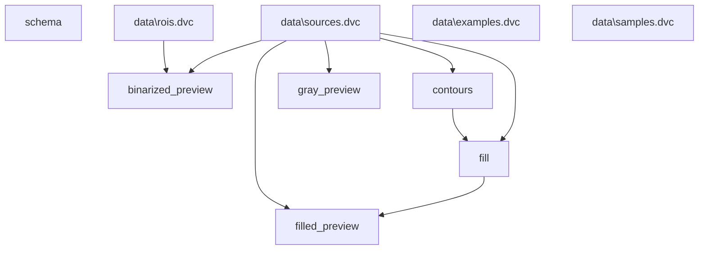

# boilercv

Computer vision routines suitable for nucleate pool boiling bubble analysis. See the [documentation](https://blakenaccarato.github.io/boilercv/) for more detail. Currently, `xarray` must be installed manually if installing as `pip install boilercv`. I intend to bundle a small example dataset to exhibit the usage of this package on arbitrary data, but this is not currently done.

## Data process graph

Graph of the data process, automatically derived from the code itself.

## Highlighted contours

Overlay of the external contours detected in one frame of a high-speed video. Represents output from the "fill" step of the data process.

