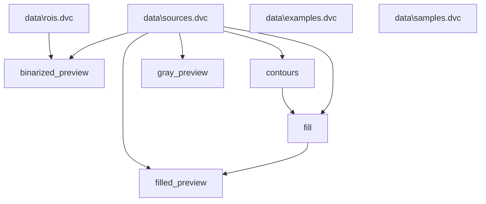

# boilercv

Computer vision routines suitable for nucleate pool boiling bubble analysis. See the [documentation](https://blakenaccarato.github.io/boilercv/) for more detail.

## Example

Overlay of the external contours detected in one frame of a high-speed video. Represents output from the "fill" step of the data process.

Data for the intermediate stages associated with the highlighted contours above is available in `tests/data`. The `cloud` subfolder represents the folder structure of intermediate inputs and outputs of pipeline stages synchronized with cloud storage, such as a Google Cloud Storage bucket. The `local` subfolder represents the folder structure of files which are too large for cloud storage, such as raw CINE video files and uncompressed data, or files which are part of manual processes prior to the start of the encoded pipeline. The `cloud` and `local` test folders represent a small sample of the full data in `data` and `~/.local/boilercv`. The full data are not shared here, but the eventual intent is to publish this data.

The test suite in `tests/test_boilercv.py` ensures that individual pipeline stages produce the expected results. Testing the `boilercv` package requires patching the hard-coded `data` and `~/.local/boilercv` paths. This repository could be forked as-is, cloned and set up by running `setup.ps1`, and data placed in the proper places (try copying the contents of `tests/data/cloud` to the top-level folder `data` and `tests/data/local` to `~/.local/boilercv` to start), and it should function.

## Data process graph

## Coming soon

Detailed project architecture and a proper tutorial for forking/cloning this repository and running the pipeline on your own data.
