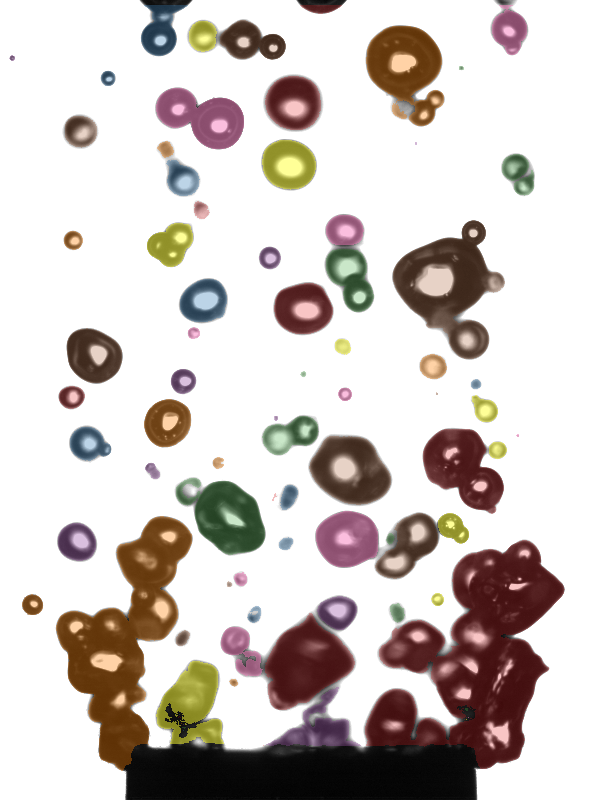
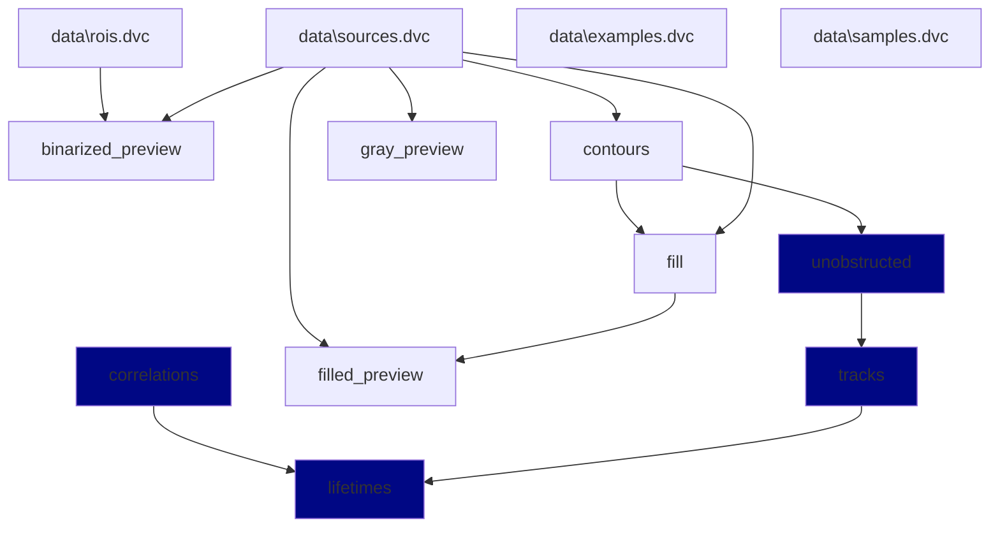

# `boilercv`

Computer vision routines suitable for nucleate pool boiling bubble analysis. See the [documentation](https://blakenaccarato.github.io/boilercv/) for more detail, including a [Binder](https://jupyter.org/binder) for running code live. Click the "launch binder" badge above and you will be able to run the notebooks in `docs/experiments` in your browser with different parameters, and even create your own notebooks.

## Example

Overlay of the external contours detected in one frame of a high-speed video. Represents output from the "fill" step of the data process.

## Overview

The [data process graph](#data-process-graph) shows the data process, and allows for individual steps in the process to be defined indpendently as Python scripts, Jupyter notebooks, or even in other languages like Matlab. The process is defined in `dvc.yaml` as as series of "stages". Each stage has dependencies and outputs. This structure allows the data process graph to be constructed, directly from the `dvc.yaml` file. This separates the concerns of data management, process development, and pipeline orchestration. This project reflects the application of data science best practices to modern engineering wokflows.

## Usage

If you would like to adopt this approach to processing your own data, you may clone this repository and begin swapping logic for your own, or use a similar architecture for your data processing. To run a working example with some actual data from this study, perform the following steps:

1. Clone this repository and open it in your terminal or IDE (e.g. `git clone https://github.com/blakeNaccarato/boilercv.git boilercv`).
2. Navigate to the clone directory in a terminal window (e.g. `cd boilercv`).
3. Create a Python 3.10 virtual environment (e.g. `py -3.11 -m venv .venv` on Windows w/ Python 3.11 installed from [python.org](https://www.python.org/)).
4. Activate the virtual environment (e.g. `.venv/scripts/activate` on Windows).
5. Run `pip install --editable .` to install `boilercv` package in an editable fashion. This step may take awhile.
6. Delete the top-level `data` directory, then copy the `cloud` folder inside `tests/data` to the root directory. Rename it to `data`.
7. Copy the `local` folder from `tests/data` to `~/.local` where `~` is your user/home folder (e.g. `C:/Users/<you>/.local` on Windows). Rename it to `boilercv`.
8. Run `dvc repro` to execute the data process up to that stage.

The data process should run the following stages: `contours`, `fill`, `filled_preview`, `binarized_preview` and `gray_preview`. You may inspect the actual code that runs during these stages in `src/boilercv/stages`, e.g. `contours.py` contains the logic for the `contours` stage. This example happens to use Python scripts, but you could define a stage in `dvc.yaml` that instead runs Matlab scripts, or any arbitrary action. This approach allows for the data process to be reliably reproduced over time, and for the process to be easily modified and extended in a collaborative effort.

There are other details of this process, such as the hosting of data in the `data` folder in a Google Cloud Bucket (alternatively it can be hosted on Google Drive), and more. This has to do with the need to store data (especially large datasets) outside of the repository, and access it in an authenticated fashion.

## Data process graph

This data process graph is derived from the code itself. It is automatically generated by [dvc](https://dvc.org/). This self-documenting process improves reproducibility and reduces documentation overhead. Nodes currently being implemented are highlighted.

## Project information

- [Changes](<https://blakeNaccarato.github.io/boilercv/changelog.html>)
- [Docs](<https://blakeNaccarato.github.io/boilercv>)
- [Contributing](<https://blakeNaccarato.github.io/boilercv/contributing.html>)
