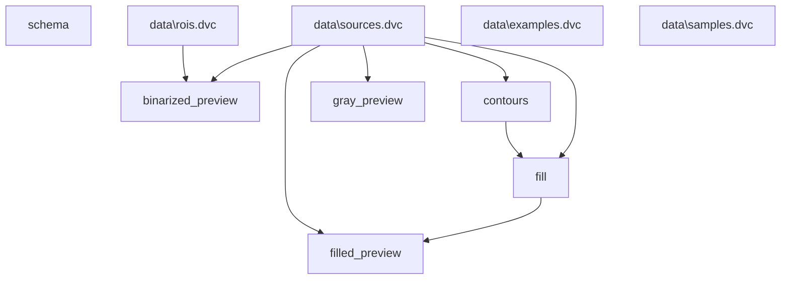

# boilercv

Computer vision routines suitable for nucleate pool boiling bubble analysis. See the [documentation](https://blakenaccarato.github.io/boilercv/) for more detail.

## Data process graph

Graph of the data process, automatically derived from the code itself.

## Example

Detected contours are highlighted in the example below. See the [documentation](https://blakenaccarato.github.io/boilercv/) for detail on the representative dataset used to generate this example, available in `tests/data`.

### Highlighted contours

Overlay of the external contours detected in one frame of a high-speed video. Represents output from the "fill" step of the data process.

## Coming soon

Detailed project architecture and a proper tutorial for forking/cloning this repository and running the pipeline on your own data.
